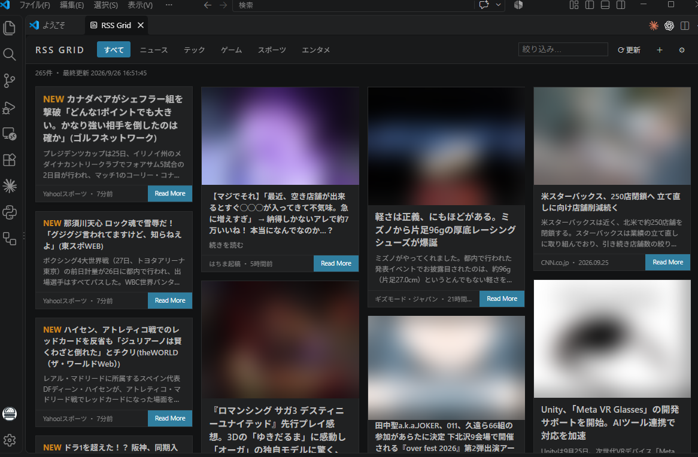

# RSS Grid

VS Code の中で RSS / Atom フィードを **画像付きグリッド** で読むリーダー拡張です。



## 使い方

- ステータスバーの `RSS`、またはコマンド `RSS Grid: 開く` で表示
- カテゴリタブ / キーワード絞り込み / ⟳ で即更新 / 自動更新（既定15分、パネル表示中のみ）
- カードをクリックするとブラウザで記事を開きます
- 画像は RSS 内（media:thumbnail・enclosure・本文の img）から取得し、無ければ記事ページの og:image を使います

## フィードとタブのカスタマイズ

`＋` ボタン、またはコマンド `RSS Grid: フィード一覧を編集(settings.json)` で編集できます。
初回は既定のフィード一覧が settings.json に書き出されるので、それを書き換えてください。

```json
"rssGrid.feeds": [
  { "label": "4Gamer", "url": "https://www.4gamer.net/rss/index.xml", "category": "ゲーム" },
  { "label": "Zenn", "url": "https://zenn.dev/feed", "category": "開発" }
]
```

- `category` がそのままタブ名になります（新しい名前を書けばタブが増えます）
- `url` のみ必須、`label` は表示名
- `rssGrid.feeds` を書くと既定の一覧は丸ごと置き換わります

| 設定 | 既定 | 内容 |
| --- | --- | --- |
| `rssGrid.itemsPerFeed` | 20 | 1フィードあたりの最大記事数 |
| `rssGrid.autoRefreshMinutes` | 15 | 自動更新の間隔（分）。0でオフ |
| `rssGrid.fetchOgImage` | true | RSSに画像が無い記事は記事ページの og:image を取りに行く |

## 既定のフィード

ニュース・テック・ゲーム・スポーツ・エンタメの日本語サイトを中心に登録しています。各フィードと記事・画像の権利はそれぞれの配信元に帰属します。

## English

An RSS/Atom reader that shows feeds as an image card grid inside VS Code.
Open it from the `RSS` status bar item or the `RSS Grid: 開く` command.
Edit feeds via the `rssGrid.feeds` setting — each feed's `category` becomes a tab.
The default feeds are mostly Japanese sites; replace them with your own.

## License

MIT
